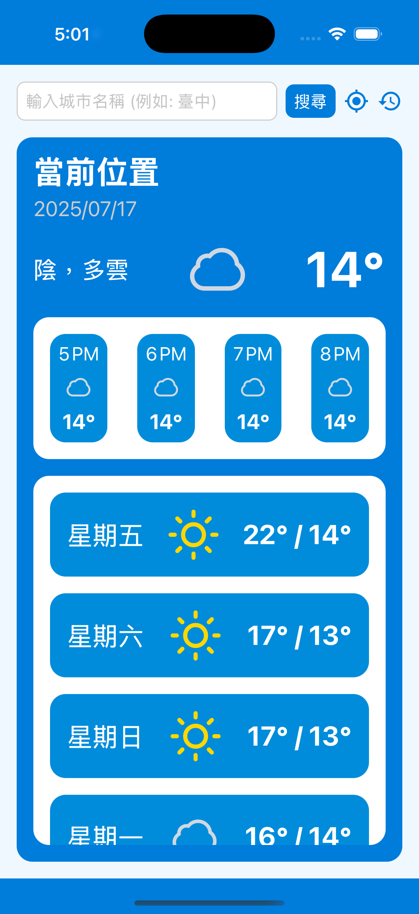

# 第 2 週目標：API 整合 + 狀態儲存 + 更豐富的畫面設計
## 🎯 DEMO：天氣 App（含歷史紀錄頁）
支援查詢城市天氣並儲存歷史，兩個畫面切換。

## 📌 學習重點：
* fetch / axios 串接 OpenWeather API
* useEffect, useState 非同步操作
* AsyncStorage 儲存歷史紀錄
* Stack Navigator 加強使用
* FlatList 畫面優化、無資料提示、Loading 狀態

## ✅ 任務實作：
* 建立兩頁：
    * 🔍 搜尋城市頁：輸入城市並查詢天氣
    * > 
    * > 
    * 📜 歷史紀錄頁：儲存並顯示最近查過的城市
    * > 
    * > 
* 使用 AsyncStorage 儲存歷史並支援清除
* 點擊歷史城市可回到查詢頁再次查詢